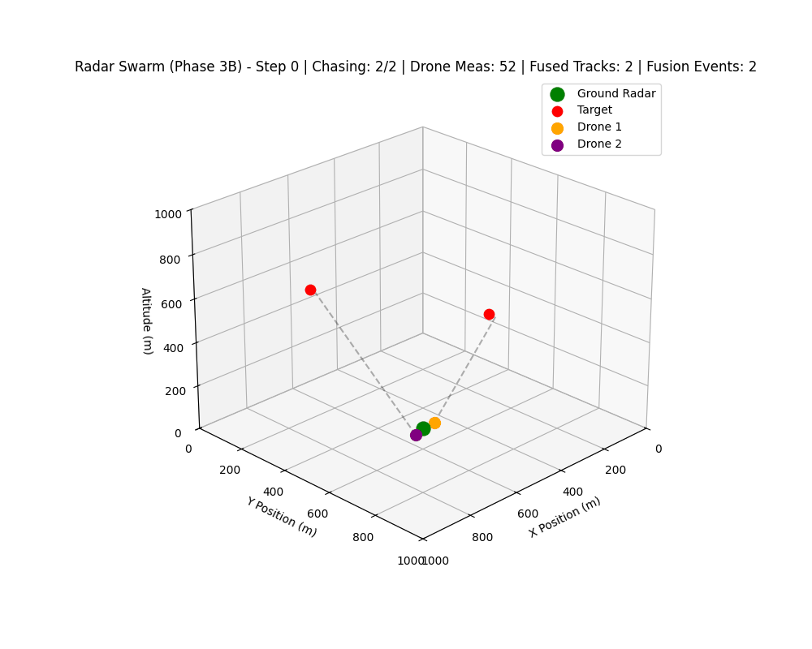

# 🦅 RADAR-SWARM: Decentralized Autonomous Drone Simulation

[](https://www.python.org/downloads/)
[](https://isocpp.org/)
[](https://opensource.org/licenses/MIT)
[]()

**RADAR-SWARM** is a high-fidelity, computationally optimized digital twin of a decentralized autonomous drone swarm. It simulates multi-agent sensor fusion, target interception, and adaptive geometric repositioning using advanced radar physics and state-space estimation models. 

This project bridges theoretical aerospace mathematics with production-grade software engineering, featuring **C++ (pybind11) acceleration** to overcome Python's GIL bottlenecks and scale to massive agent deployments.

---

## 🎥 Simulation Telemetry

*(Above: 3D Visualization of the swarm executing decentralized Track Fusion, Proportional Navigation, and GDOP Minimization)*

---

## 🧠 Core Architecture & Capabilities

The swarm operates entirely on decentralized logic without a central command node. Its intelligence is broken down into five core subsystems:

### 1. 📡 Distributed Sensing & Time Sync (Phase 3A & 3C)
* **FMCW Radar Modeling:** Each agent simulates local radar measurements with dynamic Jacobian ($H$) matrices.
* **Temporal Synchronization:** Drones possess local clock drift (simulated in ppm). Before fusion, agents execute a distributed network consensus algorithm (Eq. 191) to agree on a global timestamp.

### 2. 🧮 Track-Level Fusion Engine (Phase 3B)
* **Interacting Multiple Model (IMM):** Tracks are maintained using state-space tracking that blends Constant-Velocity and Constant-Acceleration Kalman filters.
* **Covariance Intersection & WLS:** Overlapping radar tracks from multiple drones are de-conflicted and merged using Weighted Least Squares to generate a highly accurate global tracking array.

### 3. 🎯 Decentralized Task Allocation (Phase 4A)
* **Uncertainty-Aware Assignment:** Drones assign themselves to targets using the Hungarian Algorithm (`scipy.optimize.linear_sum_assignment`). The $O(N^3)$ cost matrix balances kinematic Euclidean distance with the statistical trace of the target's covariance matrix.

### 4. 🚀 Interception Kinematics (Phase 4B)
* **Proportional Navigation (PN):** Assigned drones abandon basic pursuit and execute true missile-grade Proportional Navigation, calculating Line-of-Sight (LOS) rates to dynamically generate interception acceleration vectors.

### 5. 📐 Adaptive Geometry (Phase 5A)
* **GDOP Minimization:** Unassigned (idle) drones do not sit still. They continuously calculate the Fisher Information Matrix (FIM) of the swarm's tracking geometry. Using gradient descent, they autonomously fly into formations that minimize the Geometric Dilution of Precision (GDOP) for the active sensors.

---

## ⚡ Performance: Python + C++ (`pybind11`)

Scaling a decentralized $O(N^3)$ assignment algorithm to 50 active agents and 30 targets causes severe frame-rate drops in pure Python. 

To achieve real-time 60 FPS simulation, the heaviest mathematical bottlenecks (specifically the Hungarian cost-matrix generation balancing kinematics and covariance traces) have been offloaded to a **custom C++ extension using `pybind11`** and `Eigen`.

---

## 🛠️ Installation & Setup

### Prerequisites
* Python 3.10+
* A C++ compiler (Visual Studio Build Tools for Windows, GCC for Linux, or Xcode for Mac)

### 1. Clone the Repository
```bash
git clone [https://github.com/yourusername/RADAR-SWARM.git](https://github.com/yourusername/RADAR-SWARM.git)
cd RADAR-SWARM
